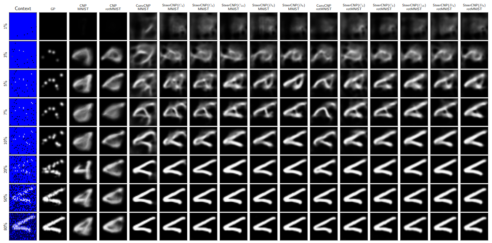

# Steerable CNPs

Implementation of SteerableCNPs (and equivariant Gaussian Processes) for the paper Equivariant Learning of Stochastic Fields: Gaussian Processes and Steerable Conditional Neural Processes

## Library

The library provides the main following functionality:

- Implementation of discretised Equivariant DeepSets architecture, and the extension to Steerable CNPs
- Utilising the E2CNN libary, a quick way to build steerable CNNs to use as the decoders in those architectures.
- Code to do simple equivariant Gaussian processes with RBF, divergence-free or curl-free kernels.
- Implementation of a MultiMNIST which paints multiple MNIST digits onto a larger canvas, randomly rotated and translated
- (optional) PyTorch-Lightning modules for the SteerableCNP, GP, and CNP for easy experimentation. Enable these by installing the PyTorch-Lightning library. 

## Installation

This repo can be installed to run the experiments by cloning the repo and running `setup_venv.sh`. Please note the additional steps in this file, and update the PyTorch version and CUDA requirements to match your system. Please note this installs additional packages such as Hydra and PyTorch-Lightning required to run the experiment code. To install the raw library to use in your own experiments, you can either clone the repo and install via `pip install -e .` or directly from github via `pip install git+git://github.com/MJHutchinson/SteerableCNP.git#egg=steer_cnp`

## Running the MNIST experiments

The main sweep of Steerable CNPs, ConvCNPs and CNPs can be run by executing the `mnist_experiments_circular_pad_blanks.sh` script.

To test these models on the various datasets, run `mnist_experiments_test_models_circular_pad_blanks.sh`.

To run the grid search over GP parameters, run `mnist_experiments_gp_sweep.sh`.

To produce the various plots and tables, use the scripts `mnist_image_plots.py` and`mnist_make_tables_plots.py`.

